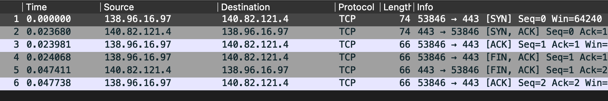
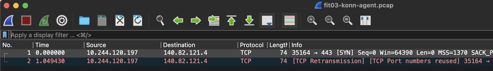
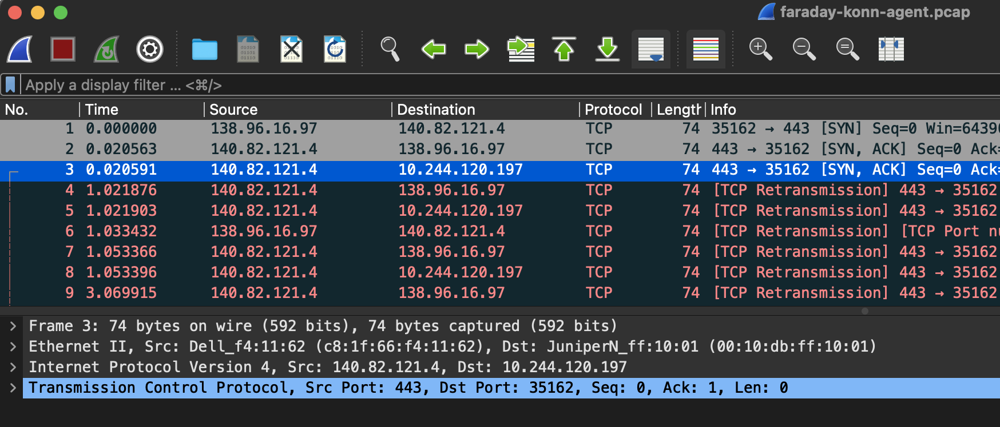
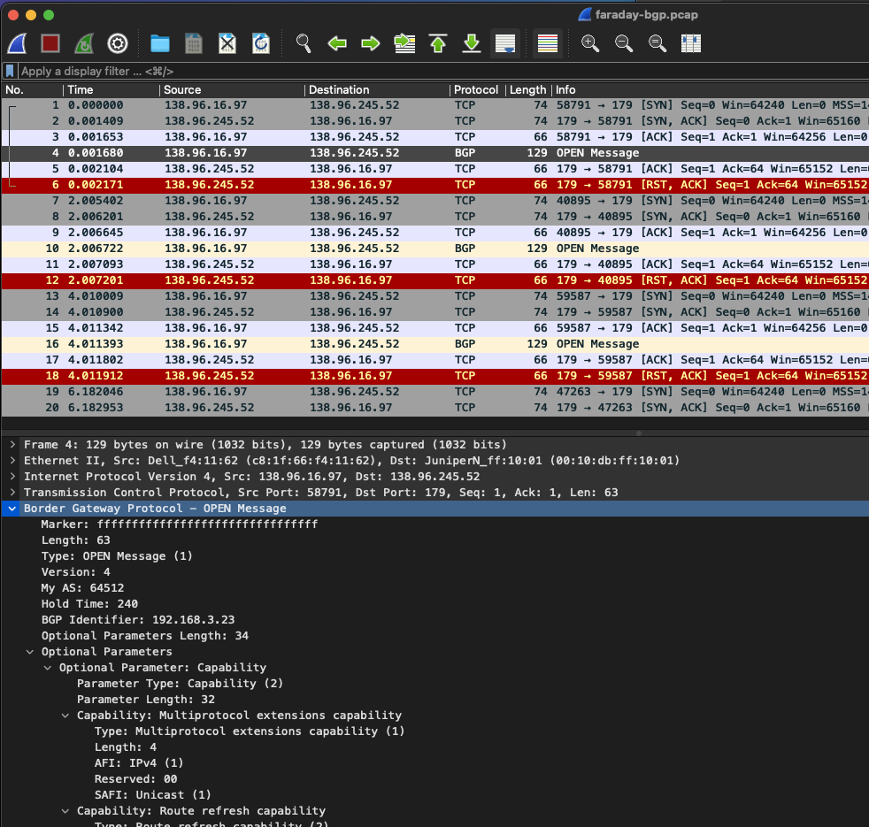
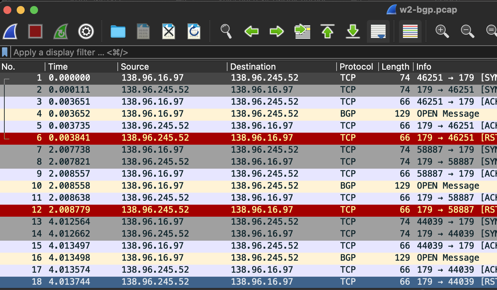

# sopnode - DIANA logbook

## networking

Edge-Core SONiC Enterprise installed sucessfully on Wedge100-32X. This image has very limited functionalities. Ok for basic scenarios but won’t be very useful on the long run.
Edge-Core does not provide SONiC image or support for the Wedge1000-32QS though they provide a brief documentation on how to setup an open source SONiC for that platform.
The issue is that compilation fails for the open source SONiC for the p4 platform (i.e., the one corresponding to the ASICs in the Wedge100 switches). The issue comes from dependencies that are incompatible. Almost 2 years since the p4 platform is not supported anymore by the open source project and unfortunately compile scripts did not “fix” the version so we have to rebuild the dependency tree with trials and errors.

## compute

### deploy k8s on the micro-cluster

- [x] 4 poweredge r640 are setup on these hostnames
  `sopnode-l1.inria.fr` - k8s control-plane
  `sopnode-w{1,2,3}.inria.fr` - k8s worker
- [x] k8s *production* cluster created on `sopnode-l1` with `sopnode-w1` as a worker
- [x] k8s *devel* cluster created on `sopnode-w2` with `sopnode-w3` as a worker

### deploy k8s on R2lab

- [x] provide a `kubernetes` image on R2lab
  this has the following capabilities
  * firewalling is turned off
  * all kube code is preinstalled and ready to run in `/root/kube-install`
    (a `git pull` won't harm, as you know the images are rather costly to produce...)
- [x] based on a super lightweight bash tool named `kube-install.sh`
  <https://github.com/parmentelat/kube-install>
  * **cluster creation**
    `kube-install.sh create-cluster`
    this sets up a `konnectivity` service
  * **joining a cluster**
    * worker side
      `kube-install.sh join-cluster r2lab@sopnode-l1.inria.fr`
      note that here the `r2lab` user is only used to enter in the master node
      and get the token needed to join (by actually running the command below)
    * leader side
      `kube-install.sh join-command`
      will just display the command for a worker node to join


### connect *sopnode* and R2lab

- [x] one node at a time - OK
  ```
  # typical set up
  rload -i kubernetes 1
  ssh root@fit01
  [fit01] kube-install.sh join-cluster r2lab@sopnode-l1.inria.fr
  ```
- [x] en masse joins
  for instance, to do it en masse
  ```
  [faraday]
  nodes -a
  n- 4 14 18 31 37
  rload -i kubernetes
  rwait
  map kube-install.sh join-cluster r2lab@sopnode-l1.inria.fr
  ```
  this turned out to work reliably on my first attempt to join these 32 nodes simultaneously with kube-install-v0.4
- [x] study consequences on the R2lab workflow
  users will never leave properly !
  so see how the k8s cluster reacts to a R2lab node being re-imaged
  - [x] apparently the k8s cluster realizes rather quick that the node is down
  - [x] from a sopnode, the following bash functions are available
    - `fit-nodes` `fit-deads` `fit-alives` gives list of fit nodes in the cluster, whether they are alive or not
    - `fit-drain-nodes` `fit-delete-nodes` to cleanse the cluster from any reference to a fit node

- [x] en masse leave
  ```
  [faraday]
  map kube-install.sh destroy-cluster

  [sopnode]
  fit-drain-nodes
  fit-delete-nodes
  ```
- [x] labelling and selecting nodes
  * use `fit-label-nodes` from a sopnode box once the nodes have joined the cluster; this sets `r2lab/node=true` on all R2lab nodes (actually all nodes returned by `fit-nodes`)
  * see https://github.com/parmentelat/kube-install/tree/devel/kiada for examples of how this can be used to select a particular node, or any node on the R2lab or the sopnode side

# troubleshooting notes

## data plane connectivity broken

here's a status as of 2022 June 1; a word on the status:
* sopnode-w2 runs as the cluster master on the so-called 'wired' side (with a public IP)
* sopnode-w3 runs as a worker on the 'wired' side as well
* fit01 is a NATed node behind faraday, on the so-called 'wireless' side

the following figure summarizes what works or not


in a nutshell, we have
* no DNS from a wireless pod (i.e. a user pod running on the wireless side)
* no ICMP connectivity between a wired pod and a wireless pod
* erratic behaviour of the `kubectl exec` command in all 4 areas (from wired or wireless, about a wired or wireless pod)


## investigation

we will focus on the network stack on `w2`, during:
* first one successful ping from (the pod in) w3 to (the pod in) w2 
* then one failing ping from (the pod in) fit01 to (the pod in) w2

so that we can compare between the two and try to find what's going wrong

### IP addresses

for that session we have

* the user pod in w2 at `10.244.112.198`
* the user pod in w3 at `10.244.210.198`
* the user pod in fit01 at `10.245.208.68`

### routes

```bash
w2# ip route
default via 138.96.245.250 dev eth0 proto dhcp metric 100
blackhole 10.244.112.192/26 proto 80
10.244.112.193 dev cali6cbe6c30032 scope link
10.244.112.194 dev caliacebfda3d6a scope link
10.244.112.195 dev cali4b51a650f43 scope link
10.244.112.196 dev cali0ec2218769a scope link
10.244.112.198 dev calie80ce743230 scope link                 <-- this is the interface for the w2 user pod
10.244.210.192/26 via 10.244.210.192 dev vxlan.calico onlink
10.245.208.64/26 via 10.245.208.64 dev vxlan.calico onlink
138.96.245.0/24 dev eth0 proto kernel scope link src 138.96.245.52 metric 100
```

### successful ping

During a PING between w3 and w2 (that is, again, a user pod running on w3 and a user pod running on w2):

* spying on w2 physical interface: one can see both echo request and echo reply flowing when doing
  ```bash
  w2# tcpdump udp port vxlan and host sopnode-w3.inria.fr -nn
  18:42:30.502186 IP 138.96.245.53.43983 > 138.96.245.52.4789: VXLAN, flags [I] (0x08), vni 4096
  IP 10.244.210.198 > 10.244.112.198: ICMP echo request, id 32992, seq 1, length 64
  18:42:30.502408 IP 138.96.245.52.60718 > 138.96.245.53.4789: VXLAN, flags [I] (0x08), vni 4096
  IP 10.244.112.198 > 10.244.210.198: ICMP echo reply, id 32992, seq 1, length 64
  ```

  ***NOTE*** that when spying on a VXLAN packet, tcpdump will print 2 lines:

    * one with the outer IP, and 
    * one with the inner IP
    
      so this above is actually 2 packets, one echo request and one echo reply

* spying on w2 virtual interface to the user pod shows the same traffic (except that the outer IP was removed)

  ```bash
  w2# tcpdump -i calie80ce743230
  18:44:19.331229 IP 10.244.210.198 > 10.244.112.198: ICMP echo request, id 16557, seq 1, length 64
  18:44:19.331253 IP 10.244.112.198 > 10.244.210.198: ICMP echo reply, id 16557, seq 1, length 64
  ```

### broken ping

During a PING between fit01 and w2, what happens is
* the echo request packet traverses faraday alright
* and it does land on w2, we can see it with a similar capture on the physical interface

  ```bash
  w2# tcpdump -i eth0 udp port vxlan and host faraday.inria.fr -nn
  18:49:09.166557 IP 138.96.16.97.50678 > 138.96.245.52.4789: VXLAN, flags [I] (0x08), vni 4096
  IP 10.245.208.68 > 10.244.112.198: ICMP echo request, id 64994, seq 1, length 64
  ```

* BUT that same packet is **NOT** forwarded to the virtual interface attached to the pod
  ```bash
  w2# tcpdump -i calie80ce743230
  <empty session>
  ```

and that's the end of that ICMP request...

### what I tried

* the puzzling thing is in both cases the packet has the **same destination address**  
  and yet it gets dealt with in a very different manner
* I tried to set rp_filter to 0 on all network interfaces - to no avail
* I tried to use `dropwatch` (install with `dnf`) to get more information on the drop;  
  the thing however is, there are a ton of dropped packets all the time,
  so it's hard to narrow down
* other techniques for trying to get more info on the drop,
  [interesting summary here](https://www.cyberciti.biz/faq/linux-show-dropped-packets-per-interface-command/)
  like:
  * `watch ip -s link show calie80ce743230`: show 0 drops
  * `watch ip -s link show eth0`: show 0 drops too ! but there are drops all the time !

* could it be the firewall ? sounds like a long shot, because
  using a single IpPool with 10.244.0.0/16 for all the cluster exhibits the exact same behaviour
  but here again it's hard to tell, because the full listing is just huge

### DNS

I have investigated the the situation with the failing DNS requests, and the root cause
is exactly similar; packets from the wireless pod make it to w2,
but don't get passed to the codedns pod

So hopefully fixing one issue should hit two birds with one stone

***
***
***
***

# archived note 1: on BGP

## WARNING: OBSOLETE

**this section is for the record only**

BGP is actually not needed with calico/VXLAN mode, so that was primarily a red herring

I just realized something odd, which I believe is strongly connected to our issue

## setup

I have the w2+w3 cluster up and running

I add to that a fit node (in my case it was fit03) and I create a pod inside that node (fping = fedora + some basic network tools)

## experiment

### connectivity from fit03's root context

of course the R2lab nodes have NAT'ed connectivity to the outside, so I can run this (140.82.121.4 is a public IP assigned to `github.com`)

```
[root@fit03 ~]# nc -z -v -w 3 140.82.121.4 443 && echo OK
Ncat: Version 7.91 ( https://nmap.org/ncat )
Ncat: Connected to 140.82.121.4:443.
Ncat: 0 bytes sent, 0 bytes received in 0.03 seconds.
OK
```

right, now, the funny thing is, I can't seem to run that **from the container** inside fit03

```
[root@fit03 ~]# container_id=$(crictl ps | grep fping | awk '{print $1}')
[root@fit03 ~]# crictl exec $container_id nc -z -v -w 3 140.82.121.4 443 && echo OK
nc: connect to 140.82.121.4 port 443 (tcp) failed: Connection timed out
FATA[0003] execing command in container: command terminated with exit code 1
```

### traffic on the wire

I have gathered the tcpdump traffic for these 2 runs, each time from faraday and from fit03

#### the OK run

basically the normal traffic should look like this



except that when captured on fit03 I have all the 138.96.16.97 (faraday.inria.fr) replaced with 192.168.3.3 (fit03) because that traffic is inside the NAT area

#### the KO run

when the connection attempt is made from the pod's container, here's what we capture from the fit03 root context



so, clearly the first SYN,ACK packet that should come back from github to the node does make it back to here

and so, observing the very same attempt but from faraday this time, we get this



so, what this means is, github receives the SYN and does answer with a SYN,ACK packet, which gets rewritten by NAT into the 10.244.x.x address for the pod, except that this SYN,ACK packet never makes it back to fit03 |

### conclusion

so the NAT on faraday does not behave as expected in this particular instance

I have reasons to believe that fixing this would help a lot, because before I played with the github address, I was trying with the apiserver IP adress (sopnode-w2)
and the same was happening; i.e. the konnectivity-agent container seems unable to connect to the API server on the master node

**EDIT**

there's one big difference indeed
* once NAT has rewritten the packet with a 192.168.3.3 dest address, this packet is routable by faraday
* but when it is rewritten as 10.244.x.x, then this falls out of the current routes, and so I guess it gets expelled back on the outside somehow

# troubleshooting BGP

May 5 - we observe that the calico-node pod on the FIT side doesn't make it to the `Ready` state

in order to troubleshoot that, I have captured the bgp traffic as seen on both faraday and fit23
(and also, but later on, from w2)

```
tcpdump host 138.96.245.52 and port bgp -nn -c 20
```

and here's what I see (the pcap files are added to this repo too)

* the traffic makes it to the node all right
* however there are some TCP-Reset packets (outlined in red by wireshark) that look pretty suspicious
* beyond that, I do not speak BGP so I can't tell more about the effectiveness of all this

## bgp traffic observed on the FIT node


## bgp traffic observed on faraday


## bgp traffic observed (later on) on w2



# tests

assuming we have
* one master on the sopnode side (abbrev L for leader)
* one worker on the sopnode side (abbrev W for worker)
* one worker on the R2lab side (NAT'ed behind faraday.inria.fr) (abbrev F for fit)

and assuming we have one pod in each node that has fedora35 and all the usual networking tools (ping, tcpdump, ip, host, hostname, ....)

Notations

| sign | meaning | comment |
|-|-|-|
| L | pod in L |
| LN | public IP address of the leader node | 138.96.x.x |
| W | pod in W |
| WN | public IP address of the worker node | 138.96.x.x - same subnet as L |
| F | pod in F |
| FN | private IP address of the fit node | (192.168.0.3)|
| | |routable in the faraday island |
| D | the k8s DNS service | 10.96.0.10 |
| 8 | external dns | 8.8.8.8 |
| GH | one github machine | 140.82.121.4 |
| | with a web service alive on 443 |

here's what we'd like to be have

| from | to | link | desired | observed |
|-|-|-|-|-|
| L | L | ping | yes | |
| L | LN | ping | yes | |
| L | W | ping | yes | |
| L | F | ping | yes | |
| L | GH | nc on 443 | yes | |

*to be completed..*