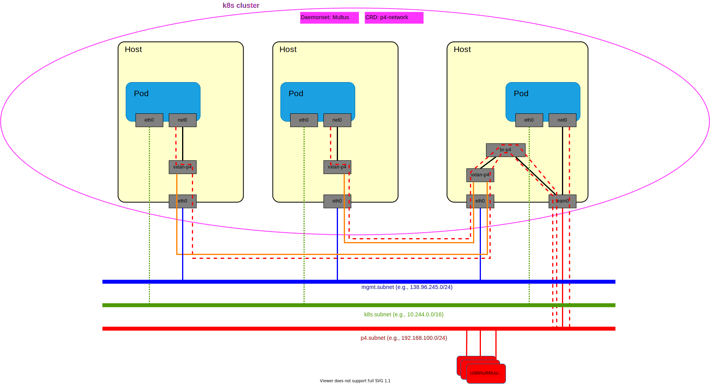

# Connecting pods to the p4-network

The Sophianode is composed of several network, among them a high speed network
programmed in p4 is deployed and called the _p4-network_. Some resources are
directly connected to the p4-network. For instances, some interfaces of the RRUs,
USRPs, and high performance compute nodes are directly connected to this network.
However, some nodes, such as the fit nodes are not directly connected to the
p4-network.

As a result, it is necessary to setup virtual interconnection between networks
and the p4-network. To that aim, we rely on a VxLAN as it allows L2 traffic to
be carried over L3 links.

Every node that needs to access the p4-network but that has not direct
connectivity with is setup to access the dedicated VxLAN. In order for the
network defined by the VxLAN to access the p4-network, at least one VxLAN
endpoint is bridged to an interface directly connected to the p4-network.

The figure below depicts the network architecture in details. In this figure,
solid-line links correspond to interface directly connected and dashed-line
show connectivity that goes over some other network or interface.



Each host has the `vxlan-p4` interface that is a VxLAN endpoint with `VNI=100`.
On hosts that have direct connectivity with the p4-network, a L2 bridge, called
`br-p4` is added and the `vxlan-p4` interface is connected to this bridge. In
addition, the interface connected to the p4-network is also connected to the
`br-p4` bridge (e.g., interface `team0` in `Host3` of the illustration) such
that the VxLAN network and on the p4-network form a unique hybrid network.

To access the p4-network, traffic must just be sent on the `vxlan-p4` interface.

## Setup connectivity on hosts

Two types of hosts have to be considered: hosts without p4-network connectivity
and hosts with p4-network connectivity. Bellow we show how to configure linux
nodes.

### Hosts with p4-network connectivity

### Hosts without p4-network connectivity

These hosts are the simplest, they only need to setup the `vxlan-p4` interface
as follows.

```bash
ip link add vxlan-p4 type vxlan id 100 dstport 4789 dev ma1
bridge fdb append to 00:00:00:00:00:00 dst 138.96.245.51  dev vxlan-p4
ip link set up dev vxlan-p4
```